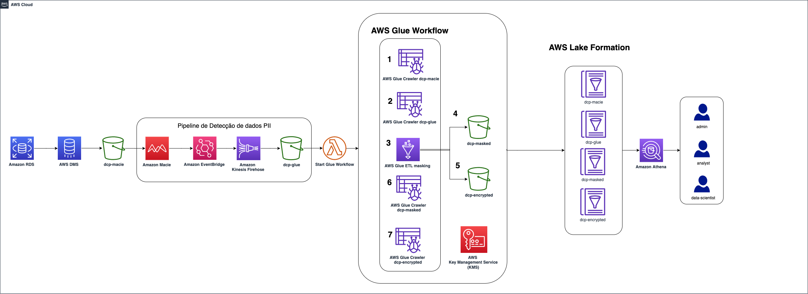

# Data masking and fine-grained access using Amazon Macie and AWS Lake Formation

## Introduction

This project illustrates how it is possible to build an architecture that makes data anomization and allows granular access to them according to well-defined rules. 

This repository provides an [AWS CloudFormation](https://aws.amazon.com/cloudformation/) template that deploys a sample solution demonstrating how to leverage [Amazon Macie](https://aws.amazon.com/pt/macie/) to automatically detect Personal Identifiable Information (PII) data, and mask the respective PII data with [AWS Glue](https://docs.aws.amazon.com/glue/l) job and using Glue workflow with EventBridge e Kinesis Firehose to form an event-driven PII data processing pipeline and configure data access permission through [AWS Lake Formation](https://docs.aws.amazon.com/lake-formation/index.html)

For the scenario where a user cannot view the sensitive data itself but can use it for training machine learning models, we will use the [AWS Key Management Service (AWS KMS)](https://aws.amazon.com/pt/kms/). In it, we will store the encryption keys that will be used to mask the data and we will only give access to the training algorithms. Users will see the masked data but only algorithms will be able to see the data in its natural form and use it to build machine learning models.

## AWS services used in this module
 1. [Amazon Athena](https://docs.aws.amazon.com/athena/latest/ug/what-is.html)
 2. [AWS CloudFormation](http://aws.amazon.com/cloudformation)
 3. [AWS DMS](http://aws.amazon.com/dms)
 4. [Amazon Elastic Compute Cloud (Amazon EC2)](http://aws.amazon.com/ec2)
 5. [AWS Glue](https://aws.amazon.com/glue)
 6. [AWS IAM](http://aws.amazon.com/iam)
 7. [AWS Key Management Service](https://docs.aws.amazon.com/kms/latest/developerguide/overview.html)
 8. [Amazon Kinesis Firehose](https://docs.aws.amazon.com/pt_br/firehose/latest/dev/what-is-this-service.html)
 9. [AWS Lake Formation](https://docs.aws.amazon.com/lake-formation/index.html)
 10. [AWS Lambda](https://docs.aws.amazon.com/lambda/latest/dg/welcome.html)
 11. [Amazon Macie](http://aws.amazon.com/macie)
 12. [Amazon RDS](http://aws.amazon.com/rds)
 13. [Amazon S3](http://aws.amazon.com/s3)
 14. [AWS Secrets Manager](https://aws.amazon.com/secrets-manager)
 15. [Amazon Virtual Private Cloud (Amazon VPC)](http://aws.amazon.com/vpc)

 ## Pre-requisites 
 1. Access to the above mentioned AWS services within AWS Account.

 2. It is important to validate that there is a pre-existing AWS Lake Formation configuration. If so, there may be permission issues. We suggest testing this solution on a development account without Lake Formation active yet. If this is not possible, see the [AWS Lake Formation](https://docs.aws.amazon.com/lake-formation/index.html) for more details on required permissions on your Role.

 3. For AWS DMS, it is necessary to give permission for it to create the necessary resources, such as the EC2 instance where the DMS tasks will run. If at any time you have worked with DMS, this permission must already exist. Otherwise, AWS Clouformation can create it. To validate that this permission already exists, navigate to the [AWS IAM](http://aws.amazon.com/iam), click on Roles, and see if there is a role named `dms-vpc-role `. If not, choose to create the role during deployment.

 4. We use the [Faker](https://faker.readthedocs.io/en/master/) library to create non-real data consisting of the following tables:
    - Customer
    - Bank
    - Card

 ## Deployment
Please refer to this [blog post]() for the detailed instructions on how to use the solution.

## Solution Overview

1. The data source will be a database, like Amazon RDS in our case. It could be a database on an Amazon EC2 instance, running in an on-premise datacenter, or even on other public clouds;

2. The AWS Database Migration Service (DMS) makes a continuous Capture-Data-Change (CDC) on this database, bringing the information to the "dcp-macie" bucket that will store the data without any treatment yet;

3. Then a Personal Identifiable Information (PII) detection pipeline is started. Amazon Macie analyzes the files and identifies fields that are considered sensitive. You can customize what these fields are, and in this case we are doing this to identify the bank account number;

4. The fields identified by Macie are sent to Eventbridge which will call the Kinesis Data Firehose service to store them in the "dcp-glue" bucket. This data will be used by Glue to know which fields to mask or encrypt using a key stored in KMS service;

5. At the end of this step, S3 is triggered from an Lambda function that starts the Glue workflow that will mask and encrypt the identified data;
    - Glue starts a crawler on bucket "dcp-macie" (1) and bucket "dcp-glue (2) to populate two tables, respectively;
    - Next, a Python script is executed (3) querying the data from these tables. It uses this information to mask and encrypt the data and then stores it in the "dcp-masked" (4) and "dcp-encrypted" (5) prefixes within the "dcp-athena" bucket;
    - The last step of this flow is to run a crawler for each of these prefixes (6 and 7) creating their respective tables in the Glue catalog.

6. To allow fine-grained access to data, AWS Lake Formation will map permissions to defined tags. We'll see how to implement being part in stages later on;

7. To query the data, we will use Amazon Athena. Other tools such as Amazon Redshift or Amazon Quicksight could be used, as well as third-party tools.

## Deployment on AWS

1.	Sign in to your AWS account
2.	Download the CloudFormation template file [here](https://gitlab.aws.dev/irisferr/mask-data-blog/-/raw/187abe2d082381c762b6e96e4a6b67057368713d/cloudformation.yml).
3.	Then upload the file in the [CloudFormation create stack page](https://console.aws.amazon.com/cloudformation/home#/stacks/create/template) to deploy the solution.
4.	Provide the CloudFormation stack a stack name or leave the value as default (“dcp”).
5.	Provide the CloudFormation stack a password on the TestUserPassword parameter for Lake Formation personas to log in to the AWS Management Console.
6.	Check the box for acknowledgement at the last step of creating the CloudFormation stack
7.	Click “Create stack” 

## Cleaning Up

To avoid incurring future charges, delete the resources.

Navigate to the [CloudFormation console](https://console.aws.amazon.com/cloudformation/) and delete the stack named “dcp” (or the stack named with your customized value during the CloudFormation stack creation step).

## Security

See [CONTRIBUTING](CONTRIBUTING.md#security-issue-notifications) for more information.

## Reference links

[Building a serverless tokenization solution to mask sensitive data](https://aws.amazon.com/blogs/compute/building-a-serverless-tokenization-solution-to-mask-sensitive-data/) 

[Como anonimizar seus dados usando o AWS Glue](https://aws.amazon.com/pt/blogs/aws-brasil/como-anonimizar-seus-dados-usando-o-aws-glue/) 

[Create a secure data lake by masking, encrypting data, and enabling fine-grained access with AWS Lake Formation](https://aws.amazon.com/blogs/big-data/create-a-secure-data-lake-by-masking-encrypting-data-and-enabling-fine-grained-access-with-aws-lake-formation/) 

[Enabling data classification for Amazon RDS database with Macie](https://aws.amazon.com/blogs/security/enabling-data-classification-for-amazon-rds-database-with-amazon-macie/) 

## License

This library is licensed under the MIT-0 License. See the [LICENSE](LICENSE) file.
